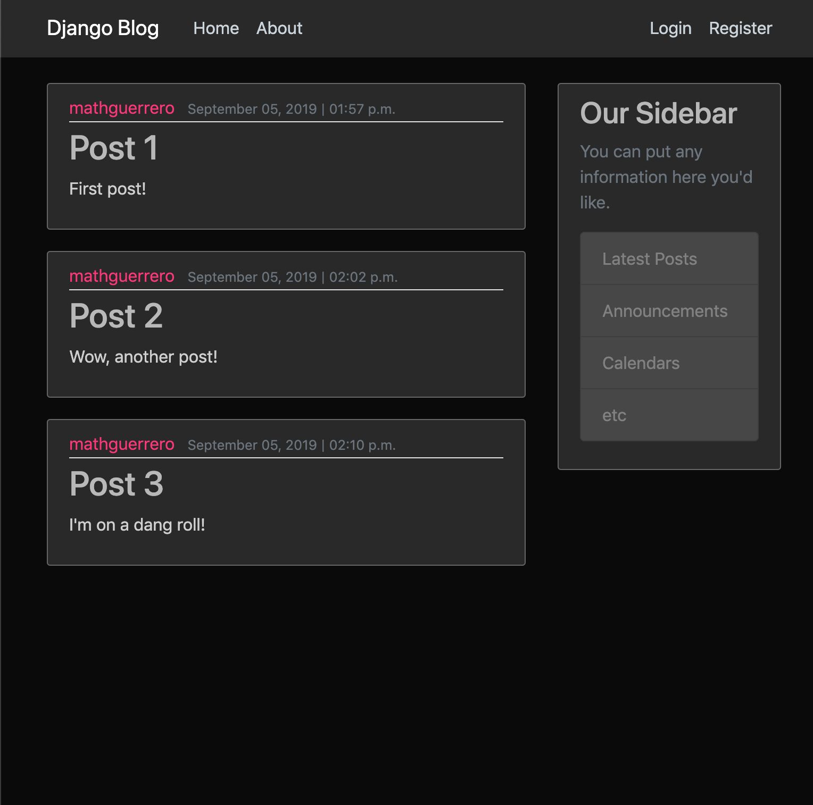
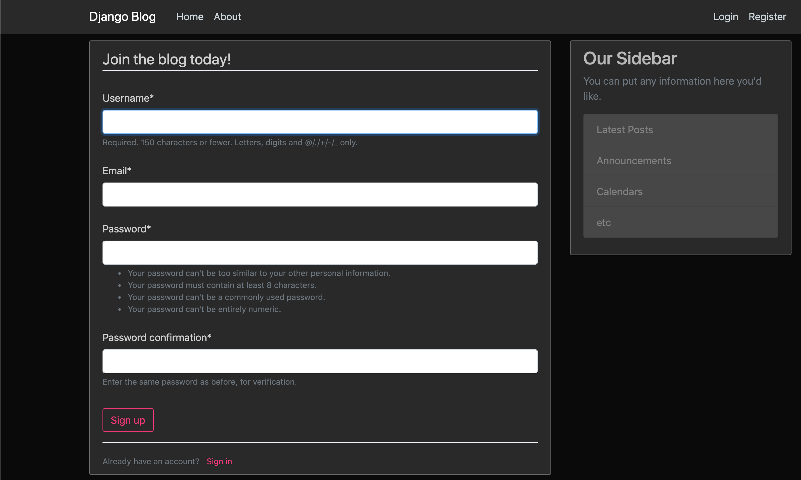

# django-blog

Credit to Corey Schafer, I followed his Django series on YouTube for this project.
https://coreyms.com/

Things I learned from this project:
- Creating Django apps
- URL routes
- Templates and template inheritance
- Bootstrap templates
- Creating super users
- Databases management (models)
- Migrating
- User registration (forms)
