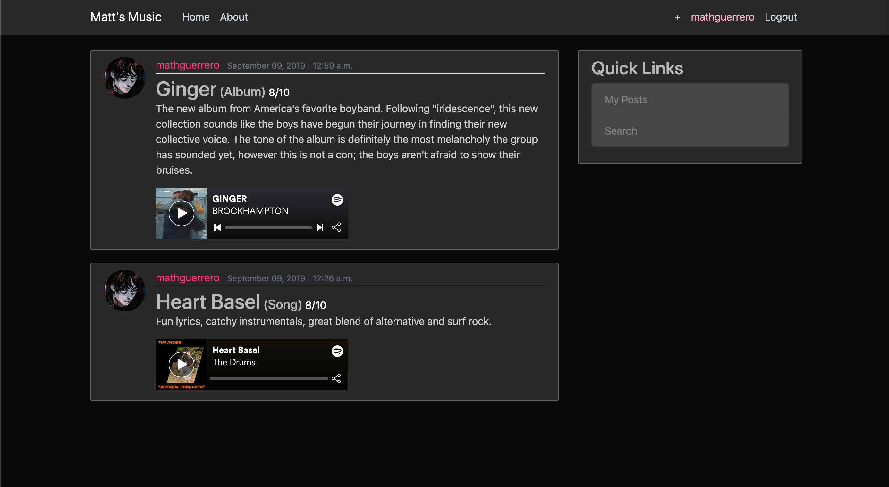
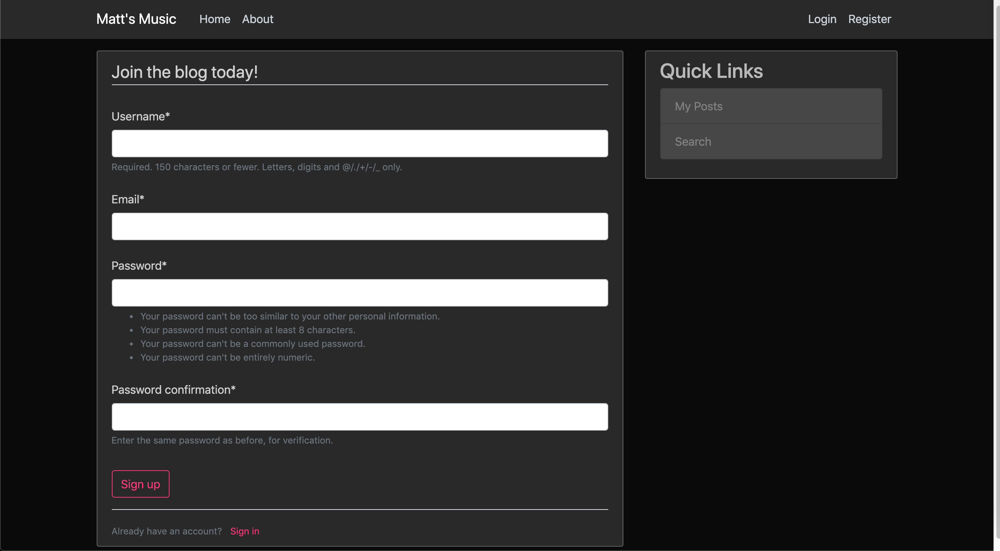

# django-blog

A WIP blog where users can make posts about either a song, album, or artist; rate the subject matter with some commentary, and provide a link (to spotify) to share music!  
Credit to Corey Schafer, I followed his Django series on YouTube for most of this project.
https://coreyms.com/  

Things I learned from this project:
- Creating Django apps
- URL routes
- Templates and template inheritance
- Bootstrap templates
- Creating users
- Database management (models)
- Migrating
- User registration (forms)
- Login and logout (authorization)
- User information and images (updating information)
- Post creation, updating, and deletion (class based views)
- Pagination (Paginator objects)
